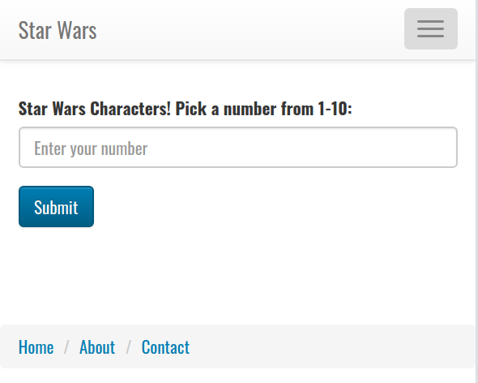

# Practical Project

This project is designed to test your knowledge of the back end. Unfortunately, there are numerous bugs that prevent this app from running. 

The home page should look like this: 

When they click on Submit, they are taken to a page that should display the name, height, and hair color of that character.

You will be using the The Starwars Database API specifically https://swapi.dev/api/people.
Read over the documentation and familiarize yourself with how to use it. 

The front-end code is provided to you as EJS files.  

You need to debug the backend and front-end files so your app is fully functional.  

Complete any additional configuration or install any necessary libraries to get this working.

Fix any and all bugs that may have been introduced so your code is working.

(HINT: no issues with public folder, partials folder or error.ejs file). All others are fair game.